<p align="center">
  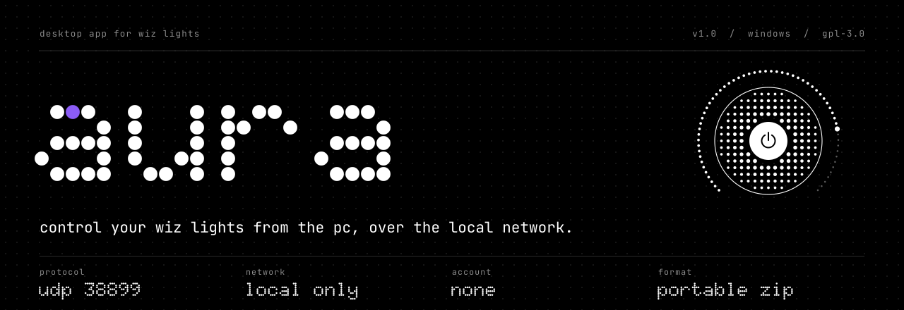
</p>

<p align="center">
  a small windows app for people with wiz smart bulbs who want to switch and tune them<br>
  from the keyboard, the tray or a window on the pc, without reaching for the phone.
</p>

<p align="center">
  <a href="https://github.com/lvxro/aura/releases/latest"></a>
  <a href="LICENSE"></a>
  <a href="#compatibility"></a>
  <a href="https://github.com/lvxro/aura/releases"></a>
</p>

<p align="center">
  <a href="https://github.com/lvxro/aura/releases/latest">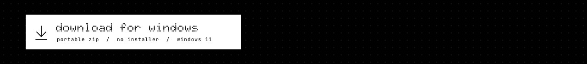</a>
</p>

<a name="screens"></a>
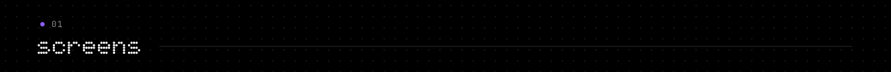

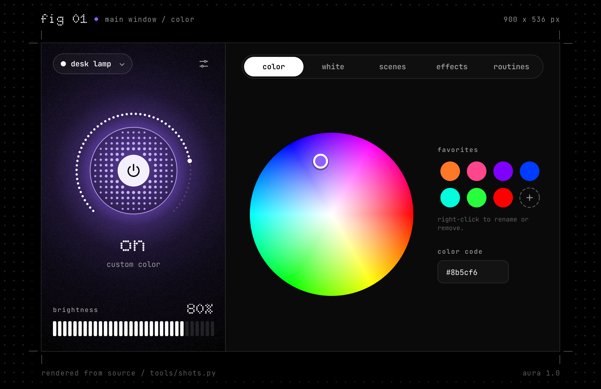

<p align="center">
  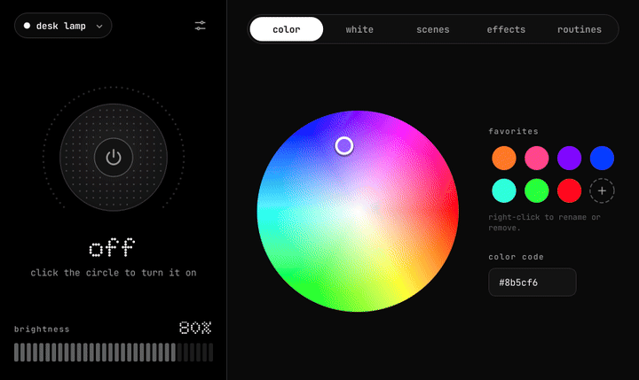
</p>

| | |
|:-:|:-:|
| 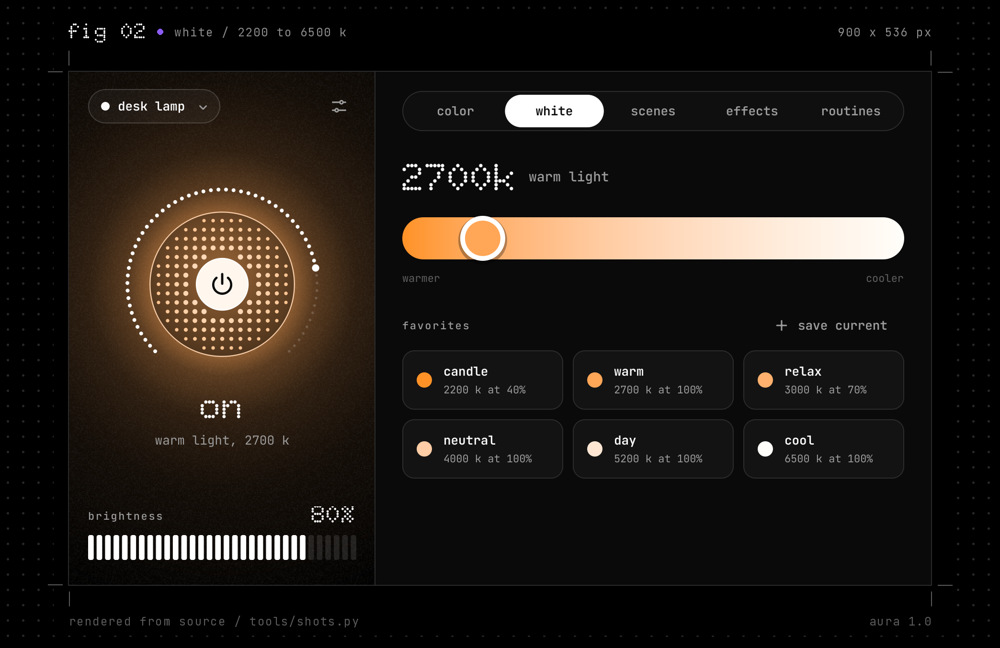 | 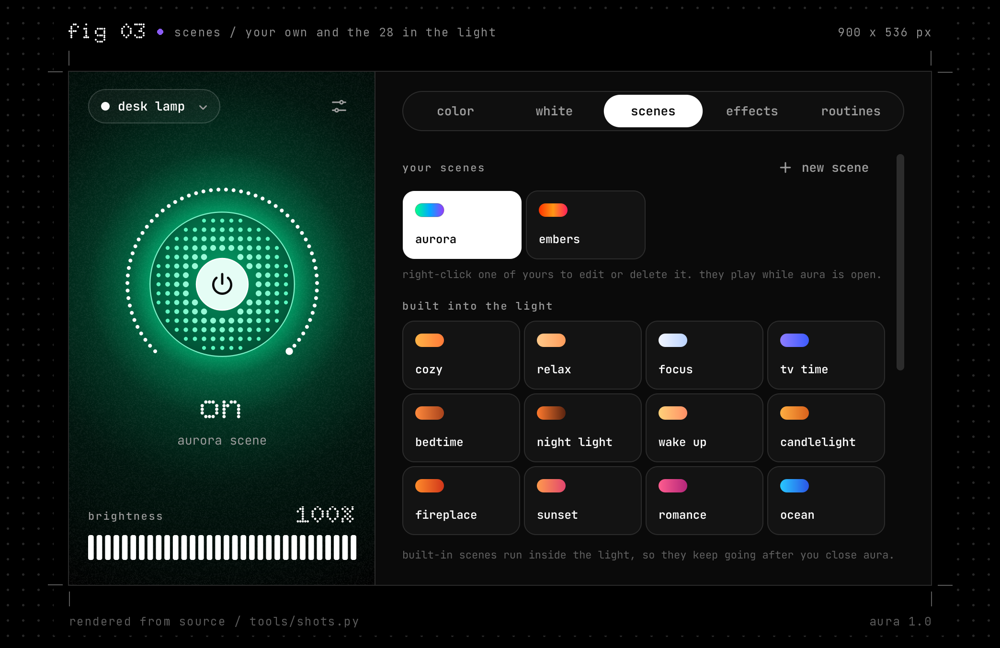 |
| 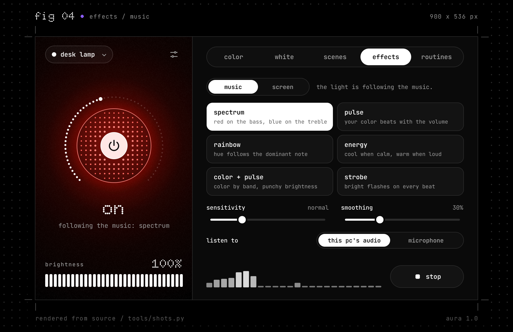 | 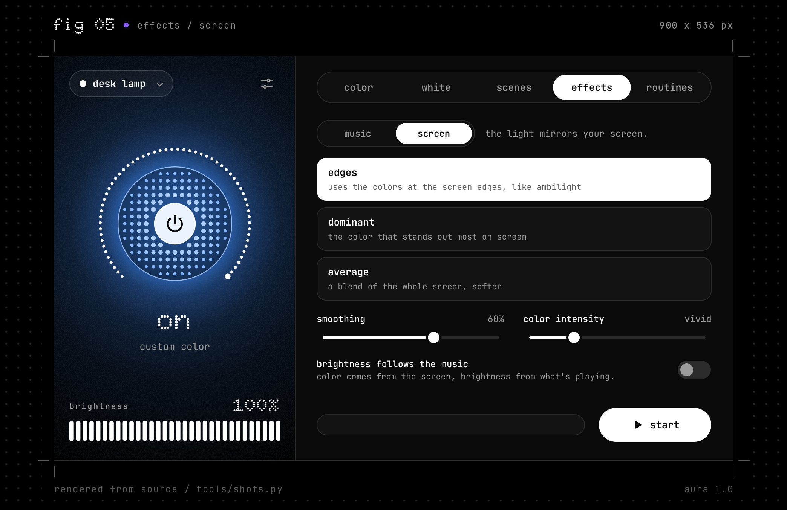 |
| 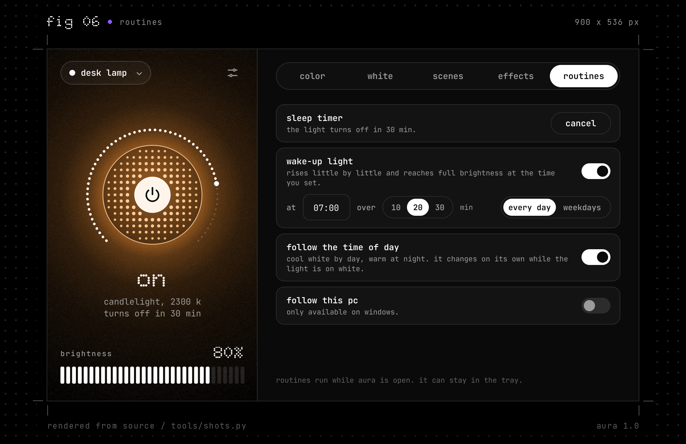 | 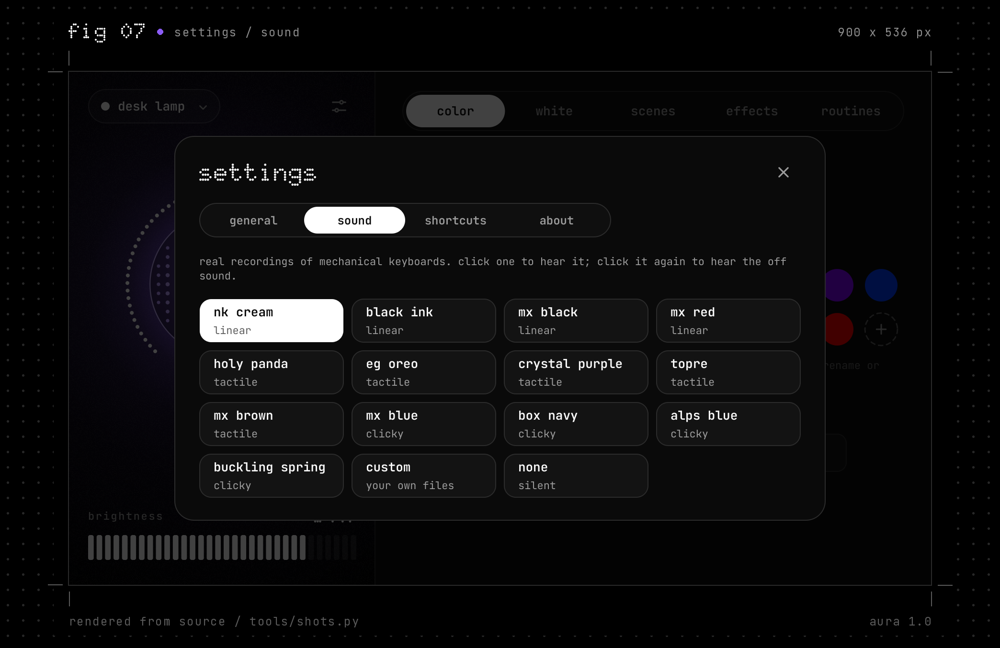 |

every image above is aura's real window. `tools/shots.py` opens the app against a simulated light and saves what it draws; `tools/readme_assets.py` adds the black sheet, the dot grid and the labels. nothing was drawn by hand.


<a name="why"></a>


- **local.** aura talks to the bulb directly over your wi-fi, with the bulb's own protocol (json over udp, port 38899). it has no account, no cloud and no telemetry, and nothing it does needs the internet.
- **portable.** unzip, open `Aura.exe`. settings live in a `data` folder next to it. to uninstall, delete the folder.
- **one click, or one key.** the big button in the window, a click on the tray icon, or `ctrl + alt + l` from any app.
- **quick commands.** `Aura.exe --toggle`, `--on` and `--off` do one thing and exit, for desktop shortcuts and scripts.
- **the usual controls.** color wheel and hex code, white from 2200 to 6500 k, brightness, favorites, and the 28 scenes built into the bulb.
- **your own scenes.** two to four colors and a pace; the light glides between them.
- **music.** the light follows what the pc is playing, or the microphone, in six modes.
- **screen.** the light takes its color from your screen, in three modes.
- **routines.** a sleep timer that dims and then turns off, a wake-up light, white that follows the time of day, and a switch that turns the light off when the pc locks or sleeps and back on when you return.
- **sound.** turning the light on or off plays a key press: thirteen recorded mechanical switches to pick from, your own file, or none.
- **english and spanish.**


<a name="install"></a>
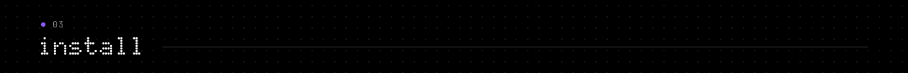

1. download the zip from the [latest release](https://github.com/lvxro/aura/releases/latest).
2. extract the whole `Aura` folder. it does not run from inside the zip.
3. open `Aura.exe`. it looks for your lights on its own; if it finds one you are done, if it finds several you pick one.

before that, the bulb has to be set up with the wiz app (ios or android) and connected to the same network as the pc. aura controls bulbs; it does not pair new ones. it also needs "allow local communication" to be on in the wiz app (settings, security). according to [home assistant's wiz documentation](https://www.home-assistant.io/integrations/wiz/), that switch is on by default.

`Aura.exe` is not code-signed, so windows may show "windows protected your pc" the first time: "more info", then "run anyway". if windows asks about network access, allow it on private networks, or aura will not find the light.

to run from source instead, see [contributing](CONTRIBUTING.md).


<a name="use"></a>
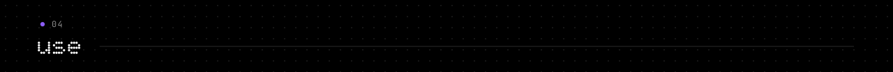

**the lamp.** the round button turns the light on and off. the ring of dots around it is the brightness: drag it, click a point on it, or use the mouse wheel over the button. the dots inside grow with the brightness and take the light's color.

**the tabs.**

| tab | what is in it |
|---|---|
| color | color wheel, hex code, favorites |
| white | temperature from 2200 to 6500 k, favorites with their own brightness |
| scenes | your own scenes, and the 28 built into the light with a speed slider |
| effects | music (six modes) and screen (three modes) |
| routines | sleep timer, wake-up light, follow the time of day, follow this pc |

**the tray.** closing the window leaves aura next to the clock, so shortcuts and routines keep working. one click on the icon turns the light on or off (or opens the window, if you prefer that in settings). right-click for brightness, favorites, the sleep timer and quit.

**what needs aura open.** your own scenes, both effects and every routine are run by aura, so they stop when you quit it; the tray is enough. the 28 built-in scenes run inside the bulb and keep going after you close aura.

strobe mode produces fast flashes. avoid it if flashing lights affect you or anyone nearby.


<a name="shortcuts-and-commands"></a>
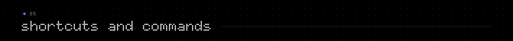

global shortcuts work from any app while aura is running. change them in settings, under shortcuts.

| shortcut | what it does |
|---|---|
| `ctrl + alt + l` | turn on and off |
| `ctrl + alt + page up` | brighter |
| `ctrl + alt + page down` | dimmer |
| `ctrl + alt + k` | next favorite (colors first, then whites) |
| `space` | turn on and off, while aura's window is in front |

commands, for desktop shortcuts and scripts. if aura is already running, the command is handed to it.

| command | what it does |
|---|---|
| `Aura.exe --toggle` | turn the light on or off, then exit |
| `Aura.exe --on` | turn the light on, then exit |
| `Aura.exe --off` | turn the light off, then exit |
| `Aura.exe --hidden` | start straight in the tray |


<a name="compared"></a>
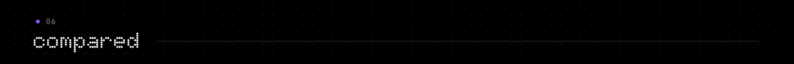

**with the wiz app.** aura does not replace it. the wiz app runs on phones (ios and android), it is where you set the bulb up, and these are things aura does not do at all:

| | aura |
|---|---|
| set up a new bulb and join it to your wi-fi | no |
| control lights from outside your home network | no |
| control several lights at once, rooms, groups | no: one light at a time, though it remembers several |
| run routines while the pc is off | no: routines need aura open |
| update the bulb's firmware | no |

what aura adds is on the pc side: a window, a tray icon, global shortcuts, commands, and effects that follow the pc's sound and screen.

**with other ways to control wiz lights from a computer.** this table is built from each project's own readme, read in october 2026. if a cell is wrong, please open an issue.

| | aura | [kek's wiz light controller](https://github.com/kek353/philipswizlightcontroller) | [wiz-hack](https://github.com/myselfshravan/wiz-hack) |
|---|---|---|---|
| what it is | windows app with a tray icon | windows app | python scripts and a local web page |
| how you get it | portable zip | exe in its releases, or run with python | clone it, install with pip |
| you use it from | window, tray, global shortcuts, commands | window | command line and browser |
| color, white, brightness | yes | yes | color and brightness |
| presets or favorites | yes | yes | not in its readme |
| music | yes: pc audio or microphone | not in its readme | yes: microphone, or audio files it plays |
| screen | yes: the live screen | not in its readme | video files it plays |
| several lights at once | no | not in its readme | yes, in its multi-light mode |
| timers and routines | yes | not in its readme | not in its readme |
| license | gpl-3.0 | gpl-3.0 | mit |

aura is a modified version of the first and takes its effect ideas from the second; see [credits and license](#credits-and-license).

if you want something other than an app: [pywizlight](https://github.com/sbidy/pywizlight) is a python library with a command line for the same local protocol, and [home assistant](https://www.home-assistant.io/integrations/wiz/) has a local wiz integration for whole-home automation.


<a name="trust"></a>
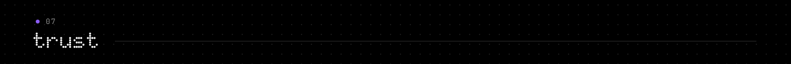

an app that sits in your tray and talks on your network should say exactly what it does.

**what goes on the network.** udp packets to your local network, and nothing else. to find lights, aura sends a broadcast on port 38899 from each network adapter. after that it talks to the bulb's ip address on the same port: commands when you change something, and a state request every 4 seconds while it is open. there is no http, no update check, no analytics and no server of any kind. every network socket in the program is in [`app/aura/wiz.py`](app/aura/wiz.py). the only other channel is a local pipe on your own pc, which a second `Aura.exe` uses to hand its command to the one already running.

**what it reads from the pc, and only while that effect is on.** the screen effect samples your screen and reduces it to one color. the music effect listens to what the pc is playing, or to the microphone if you choose it, and reduces it to levels. neither is saved or sent anywhere; the only thing that leaves the pc is the resulting color and brightness, to the bulb.

**what it saves, and where.**

| what | where |
|---|---|
| your lights (name, ip, mac, model), favorites, scenes, routines, settings | `data\aura.json`, in aura's folder |
| the error log, only if something crashes | `data\error.log` |
| your own on/off sounds, if you add them | `data\sounds\` |
| the "start with windows" entry, only while that switch is on | one value named `Aura` under `HKCU\Software\Microsoft\Windows\CurrentVersion\Run` |

if aura's folder is read-only, `data` goes to `%LOCALAPPDATA%\Aura` instead. on its first run, aura also looks for lights saved by kek's wiz light controller (in `%LOCALAPPDATA%\KeksWizLightController`) and imports them; it does not change that folder.

**no account, no telemetry, no updater.** aura never contacts this repository or anything else on the internet. new versions are downloaded by you, from the releases page.

**how the zip is made.** three scripts, all in [`tools`](tools):

```
python tools/fetch_deps.py        downloads python 3.12 for windows and four wheels, and checks each against a pinned sha-256
python tools/build_launcher.py    compiles Aura.exe (launcher/launcher.c) with zig
python tools/build_portable.py    assembles the folder, checks every bundled binary's imports, and zips it
```

the python runtime and the libraries are bundled unmodified. aura's own code is in the zip as plain python, in the `app` folder: what runs is what you can read. the release was built on linux; running the build twice there produced byte-identical zips.

**how to check your download.** each release lists the sha-256 of its zip. compare it with yours, in powershell:

```powershell
Get-FileHash .\aura-1.0-portable.zip -Algorithm SHA256
```

or in the command prompt:

```
certutil -hashfile aura-1.0-portable.zip SHA256
```


<a name="compatibility"></a>
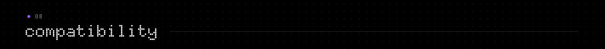

"tested" means the author used every feature on that setup. "not tested" means nobody has reported either way; it does not mean broken.

| | status |
|---|---|
| windows 11 | tested |
| windows 10 | not tested |
| wiz color bulb, e27, rgb and tunable white, 8 w, wi-fi | tested |
| other wiz color bulbs | not tested |
| wiz tunable white and dimmable-only bulbs | not tested |
| wiz plugs, strips and other devices | not tested |
| more than one light saved | not tested with real lights |
| linux, macos | not supported: there is no build, and shortcuts, pc events and sounds are windows-only |

separately, the automated tests (151 checks on the interface, plus the protocol and the effects) run on linux against a simulated light. they cover the protocol, the interface, the routines and the effects' math; they cannot cover what only windows does.

if you run aura on something marked "not tested", an issue saying how it went is welcome.


<a name="faq"></a>
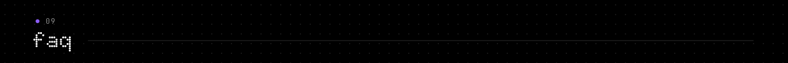

**do i still need the wiz app?**
yes, to set up a bulb the first time. after that aura works on its own.

**it cannot find my light.**
check that the bulb has power and that the pc is on the same network (not a guest network). if you use a vpn, try disconnecting it. check that "allow local communication" is on in the wiz app. you can also add the light by ip address, in "your lights".

**it says "offline".**
if the router gave the bulb a new address, aura looks for it again by its mac address on its own.

**can it control several lights at once?**
no. it remembers several and you switch between them, but it controls one at a time.

**do routines run with aura closed?**
no. they need aura running; the tray is enough. turn on "start with windows" in settings if you want it always there.

**the music effect does not react.**
something has to be playing through windows' default audio output. try raising the sensitivity.

**a shortcut does nothing.**
another program may be using it. settings, under shortcuts, shows a note next to it; pick another combination.

**aura does not open.**
look at `data\error.log`. you can also run `app\start.bat`, which starts the program a different way.

**how do i uninstall it?**
turn off "start with windows" if you turned it on, quit aura from the tray, delete the folder.


<a name="roadmap"></a>


ideas, not promises.

- more rows marked "tested" in the compatibility table. this depends on reports from people with other setups.
- using a phone as a remote for the pc's aura, over the local network.

not planned for now: controlling several lights at once.


<a name="contributing"></a>


bug reports, compatibility reports and pull requests are welcome. [CONTRIBUTING.md](CONTRIBUTING.md) explains how to run aura from source, run the tests, and build the zip.


<a name="credits-and-license"></a>
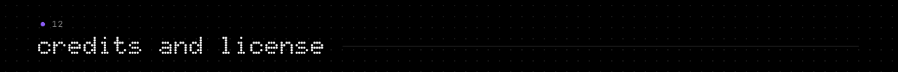

aura is free software under the [gnu gpl, version 3](LICENSE).

- it is a modified version of [kek's wiz light controller](https://github.com/kek353/philipswizlightcontroller) by eshaan pisal (gpl-3.0). local control, discovery, lights saved by mac address, the color and white modes, presets and syncing with the bulb come from there. the code was rewritten, but aura started from that program and keeps its license.
- the music and screen effects are inspired by [wiz-hack](https://github.com/myselfshravan/wiz-hack) by shravan revanna (mit). the ideas were reimplemented; no code was copied.
- the wiz protocol is documented by the community in [pywizlight](https://github.com/sbidy/pywizlight).
- the on/off sounds are real recordings from [mechvibes](https://github.com/hainguyents13/mechvibes) by hai nguyen and [kbsim](https://github.com/tplai/kbsim) by thomas lai (both mit).
- the typefaces are [doto](https://github.com/oliverlalan/Doto) and [jetbrains mono](https://github.com/JetBrains/JetBrainsMono) (both sil open font license).
- this readme follows the structure of [sniffnet's](https://github.com/GyulyVGC/sniffnet), found through [awesome-readme](https://github.com/matiassingers/awesome-readme).

the full list, with copyright lines and what was changed, is in [NOTICE](NOTICE).

"wiz" is a trademark of signify. aura is an independent project: it is not affiliated with, sponsored by or endorsed by wiz, signify or nothing. its look is inspired by dot-matrix industrial design in general and uses no logo, typeface or material from nothing.
